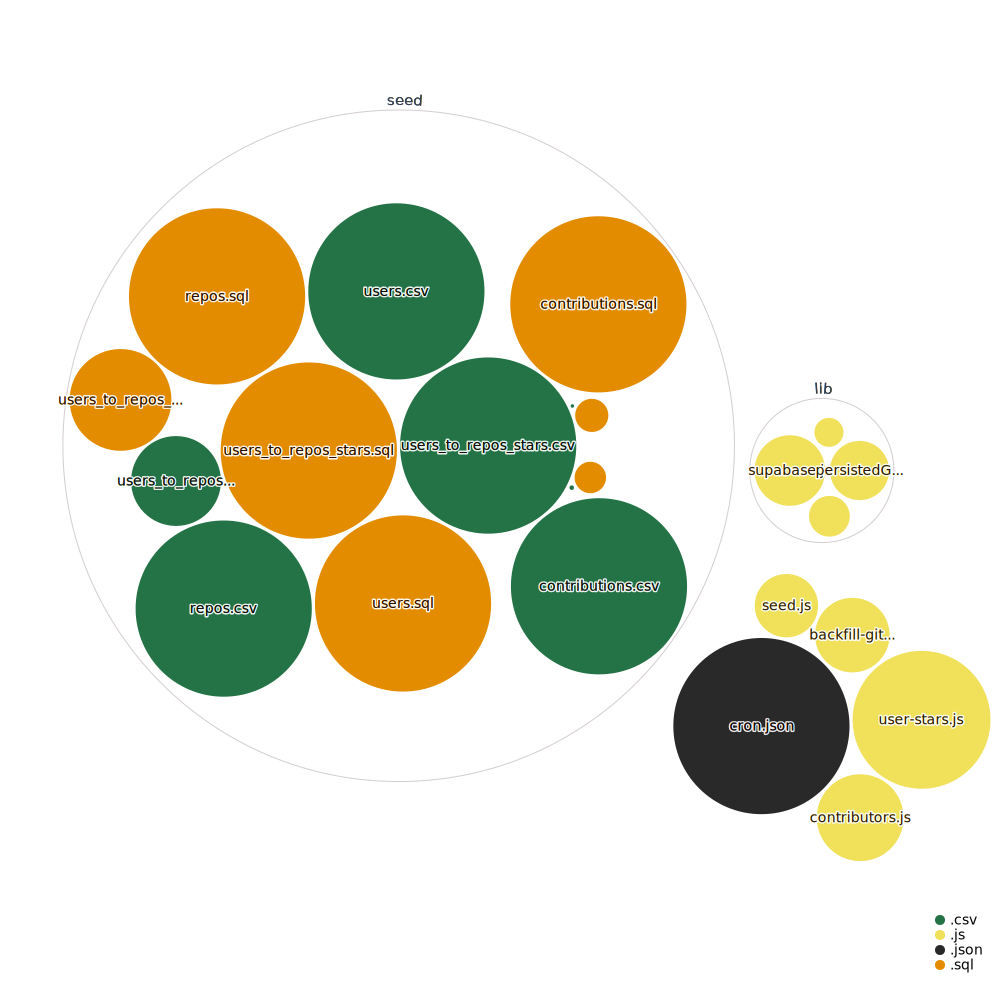

<div align="center">
  <br>
  
  <h1>🍕 Open Sauced Populate Supabase Test🍕</h1>
  <strong>The path to your next Open Source contribution</strong>
</div>
<br>
<p align="center">
  
  
  <a href="https://github.com/0-vortex/open-sauced-supabase-cron-test/issues">
    
  </a>
  <a href="https://github.com/0-vortex/open-sauced-supabase-cron-test/releases">
    
  </a>
  <a href="https://discord.gg/U2peSNf23P">
    
  </a>
  <a href="https://twitter.com/saucedopen">
    
  </a>
</p>


## 📖 Prerequisites

In order to run the project from a container we need `node>=16`, `npm>=8` and `docker>=20` installed on our development machines.

# 🔑 Database commands

### Starting the Supabase Studio

First thing we have to do for [local development](https://supabase.com/docs/guides/local-development) is start the studio locally at [localhost:54321](http://localhost:54321):

```shell
npm run db:start
```

### Make changes

If we are adding a new table structure, first do it visually in the Supabase Studio and test locally.

Check the migration difference with the following command:

```shell
npm run db:changes
```

If everything is fine we can run the following command to apply the changes to the database:

```shell
npm run db:commit add_table_name
```

### Test changes

Simplest way to test the migrations are working is to reset the local database:

```shell
npm run db:reset
```

### Push changes

If everything is fine we can push the changes to the remote database:

```shell
npm run db:push
```

# 🔑 Supabase structure

Click the image to see the schema diagram full documentation.

[](./supabase/diagrams/README.md)

# 🤝 Contributing

We encourage you to contribute to Open Sauced! Please check out the [Contributing guide](https://docs.opensauced.pizza/contributing/introduction-to-contributing/) for guidelines about how to proceed.


## 🍕 Community

Got Questions? Join the conversation in our [Discord](https://discord.gg/U2peSNf23P).  
Find Open Sauced videos and release overviews on our [YouTube Channel](https://www.youtube.com/channel/UCklWxKrTti61ZCROE1e5-MQ).

## 🎦 Repository Visualization

[
](./src)

## ⚖️ LICENSE

MIT © [Open Sauced](LICENSE)
