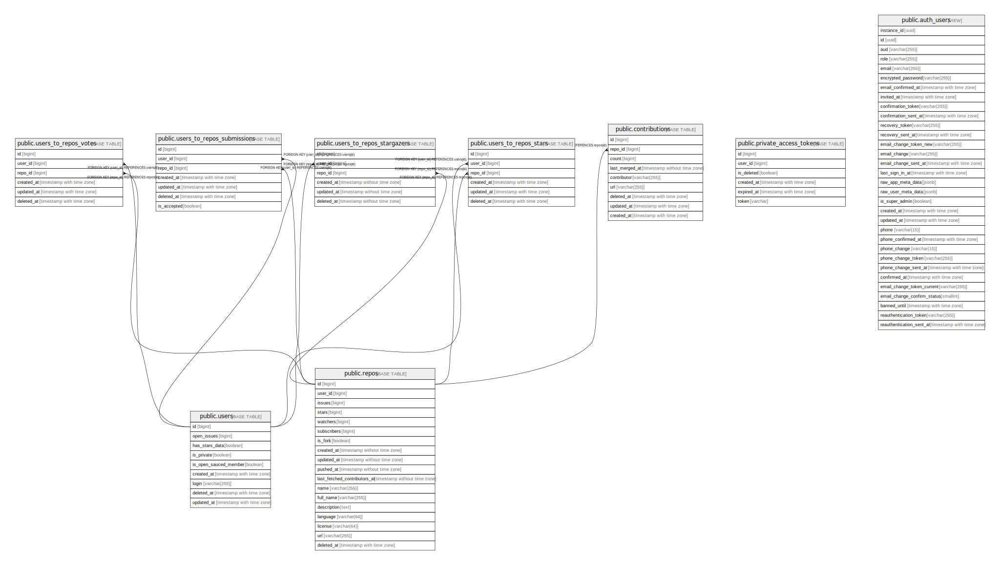

# hot.opensauced.pizza supabase

## Description

🍕 The backend for the site that recommends the hottest projects on GitHub.

## Tables

| Name                                                          | Columns | Comment | Type       |
| ------------------------------------------------------------- | ------- | ------- | ---------- |
| [public.repos](public.repos.md)                               | 17      |         | BASE TABLE |
| [public.users](public.users.md)                               | 7       |         | BASE TABLE |
| [public.users_to_repos_stars](public.users_to_repos_stars.md) | 4       |         | BASE TABLE |
| [public.users_to_repos_votes](public.users_to_repos_votes.md) | 4       |         | BASE TABLE |

## Relations

---

> Generated by [tbls](https://github.com/k1LoW/tbls)
