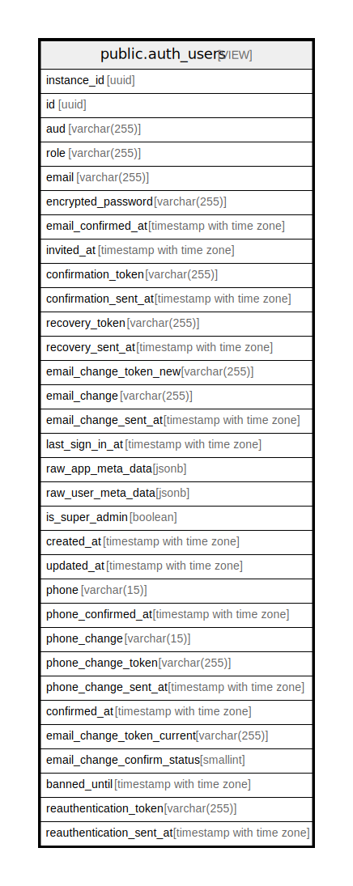

# public.auth_users

## Description

<details>
<summary><strong>Table Definition</strong></summary>

```sql
CREATE VIEW auth_users AS (
 SELECT users.instance_id,
    users.id,
    users.aud,
    users.role,
    users.email,
    users.encrypted_password,
    users.email_confirmed_at,
    users.invited_at,
    users.confirmation_token,
    users.confirmation_sent_at,
    users.recovery_token,
    users.recovery_sent_at,
    users.email_change_token_new,
    users.email_change,
    users.email_change_sent_at,
    users.last_sign_in_at,
    users.raw_app_meta_data,
    users.raw_user_meta_data,
    users.is_super_admin,
    users.created_at,
    users.updated_at,
    users.phone,
    users.phone_confirmed_at,
    users.phone_change,
    users.phone_change_token,
    users.phone_change_sent_at,
    users.confirmed_at,
    users.email_change_token_current,
    users.email_change_confirm_status,
    users.banned_until,
    users.reauthentication_token,
    users.reauthentication_sent_at
   FROM auth.users
)
```

</details>

## Referenced Tables

- [auth.users](auth.users.md)

## Columns

| Name                        | Type                     | Default | Nullable | Children | Parents | Comment |
| --------------------------- | ------------------------ | ------- | -------- | -------- | ------- | ------- |
| instance_id                 | uuid                     |         | true     |          |         |         |
| id                          | uuid                     |         | true     |          |         |         |
| aud                         | varchar(255)             |         | true     |          |         |         |
| role                        | varchar(255)             |         | true     |          |         |         |
| email                       | varchar(255)             |         | true     |          |         |         |
| encrypted_password          | varchar(255)             |         | true     |          |         |         |
| email_confirmed_at          | timestamp with time zone |         | true     |          |         |         |
| invited_at                  | timestamp with time zone |         | true     |          |         |         |
| confirmation_token          | varchar(255)             |         | true     |          |         |         |
| confirmation_sent_at        | timestamp with time zone |         | true     |          |         |         |
| recovery_token              | varchar(255)             |         | true     |          |         |         |
| recovery_sent_at            | timestamp with time zone |         | true     |          |         |         |
| email_change_token_new      | varchar(255)             |         | true     |          |         |         |
| email_change                | varchar(255)             |         | true     |          |         |         |
| email_change_sent_at        | timestamp with time zone |         | true     |          |         |         |
| last_sign_in_at             | timestamp with time zone |         | true     |          |         |         |
| raw_app_meta_data           | jsonb                    |         | true     |          |         |         |
| raw_user_meta_data          | jsonb                    |         | true     |          |         |         |
| is_super_admin              | boolean                  |         | true     |          |         |         |
| created_at                  | timestamp with time zone |         | true     |          |         |         |
| updated_at                  | timestamp with time zone |         | true     |          |         |         |
| phone                       | varchar(15)              |         | true     |          |         |         |
| phone_confirmed_at          | timestamp with time zone |         | true     |          |         |         |
| phone_change                | varchar(15)              |         | true     |          |         |         |
| phone_change_token          | varchar(255)             |         | true     |          |         |         |
| phone_change_sent_at        | timestamp with time zone |         | true     |          |         |         |
| confirmed_at                | timestamp with time zone |         | true     |          |         |         |
| email_change_token_current  | varchar(255)             |         | true     |          |         |         |
| email_change_confirm_status | smallint                 |         | true     |          |         |         |
| banned_until                | timestamp with time zone |         | true     |          |         |         |
| reauthentication_token      | varchar(255)             |         | true     |          |         |         |
| reauthentication_sent_at    | timestamp with time zone |         | true     |          |         |         |

## Relations



---

> Generated by [tbls](https://github.com/k1LoW/tbls)
