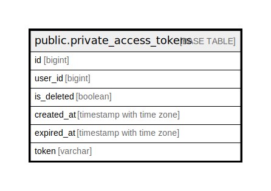

# public.private_access_tokens

## Description

## Columns

| Name       | Type                     | Default                 | Nullable | Children | Parents | Comment |
| ---------- | ------------------------ | ----------------------- | -------- | -------- | ------- | ------- |
| id         | bigint                   |                         | false    |          |         |         |
| user_id    | bigint                   |                         | false    |          |         |         |
| is_deleted | boolean                  |                         | false    |          |         |         |
| created_at | timestamp with time zone | now()                   | true     |          |         |         |
| expired_at | timestamp with time zone |                         | true     |          |         |         |
| token      | varchar                  | '32'::character varying | false    |          |         |         |

## Constraints

| Name                       | Type        | Definition       |
| -------------------------- | ----------- | ---------------- |
| private_access_tokens_pkey | PRIMARY KEY | PRIMARY KEY (id) |

## Indexes

| Name                       | Definition                                                                                      |
| -------------------------- | ----------------------------------------------------------------------------------------------- |
| private_access_tokens_pkey | CREATE UNIQUE INDEX private_access_tokens_pkey ON public.private_access_tokens USING btree (id) |

## Relations

---

> Generated by [tbls](https://github.com/k1LoW/tbls)
