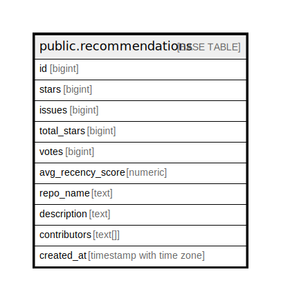

# public.recommendations

## Description

## Columns

| Name              | Type                     | Default | Nullable | Children | Parents | Comment |
| ----------------- | ------------------------ | ------- | -------- | -------- | ------- | ------- |
| id                | bigint                   |         | false    |          |         |         |
| stars             | bigint                   | 0       | false    |          |         |         |
| issues            | bigint                   | 0       | false    |          |         |         |
| total_stars       | bigint                   | 0       | false    |          |         |         |
| votes             | bigint                   | 0       | false    |          |         |         |
| avg_recency_score | numeric                  |         | true     |          |         |         |
| repo_name         | text                     |         | true     |          |         |         |
| description       | text                     |         | true     |          |         |         |
| contributors      | text[]                   |         | true     |          |         |         |
| created_at        | timestamp with time zone | now()   | true     |          |         |         |

## Constraints

| Name                 | Type        | Definition       |
| -------------------- | ----------- | ---------------- |
| recommendations_pkey | PRIMARY KEY | PRIMARY KEY (id) |

## Indexes

| Name                 | Definition                                                                          |
| -------------------- | ----------------------------------------------------------------------------------- |
| recommendations_pkey | CREATE UNIQUE INDEX recommendations_pkey ON public.recommendations USING btree (id) |

## Relations

---

> Generated by [tbls](https://github.com/k1LoW/tbls)
