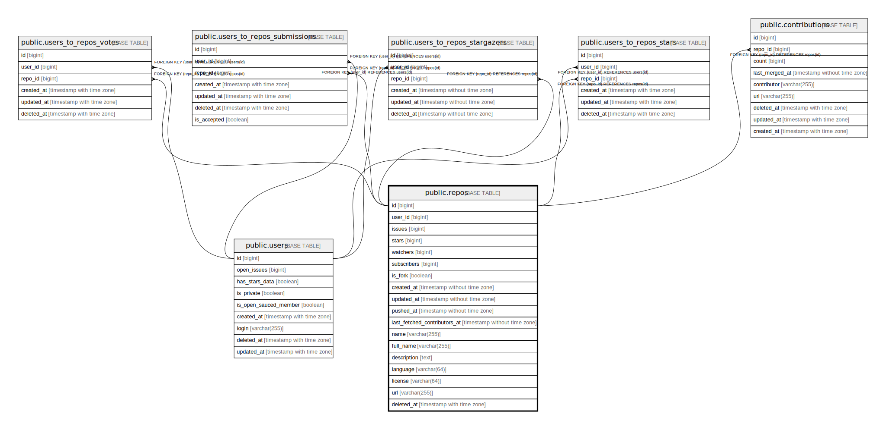

# public.repos

## Description

## Columns

| Name                         | Type                        | Default | Nullable | Children                                                                                                                    | Parents                         | Comment |
| ---------------------------- | --------------------------- | ------- | -------- | --------------------------------------------------------------------------------------------------------------------------- | ------------------------------- | ------- |
| id                           | bigint                      |         | false    | [public.users_to_repos_stars](public.users_to_repos_stars.md) [public.users_to_repos_votes](public.users_to_repos_votes.md) |                                 |         |
| user_id                      | bigint                      |         | false    |                                                                                                                             | [public.users](public.users.md) |         |
| issues                       | bigint                      | 0       | false    |                                                                                                                             |                                 |         |
| stars                        | bigint                      | 0       | false    |                                                                                                                             |                                 |         |
| watchers                     | bigint                      | 0       | false    |                                                                                                                             |                                 |         |
| subscribers                  | bigint                      | 0       | false    |                                                                                                                             |                                 |         |
| is_fork                      | boolean                     | false   | false    |                                                                                                                             |                                 |         |
| created_at                   | timestamp without time zone | now()   | true     |                                                                                                                             |                                 |         |
| updated_at                   | timestamp without time zone | now()   | true     |                                                                                                                             |                                 |         |
| pushed_at                    | timestamp without time zone | now()   | true     |                                                                                                                             |                                 |         |
| last_fetched_contributors_at | timestamp without time zone |         | true     |                                                                                                                             |                                 |         |
| name                         | varchar(255)                |         | true     |                                                                                                                             |                                 |         |
| full_name                    | varchar(255)                |         | true     |                                                                                                                             |                                 |         |
| description                  | text                        |         | true     |                                                                                                                             |                                 |         |
| language                     | varchar(64)                 |         | true     |                                                                                                                             |                                 |         |
| license                      | varchar(64)                 |         | true     |                                                                                                                             |                                 |         |
| url                          | varchar(255)                |         | true     |                                                                                                                             |                                 |         |

## Constraints

| Name            | Type        | Definition       |
| --------------- | ----------- | ---------------- |
| user_stars_pkey | PRIMARY KEY | PRIMARY KEY (id) |

## Indexes

| Name            | Definition                                                           |
| --------------- | -------------------------------------------------------------------- |
| user_stars_pkey | CREATE UNIQUE INDEX user_stars_pkey ON public.repos USING btree (id) |

## Relations

---

> Generated by [tbls](https://github.com/k1LoW/tbls)
