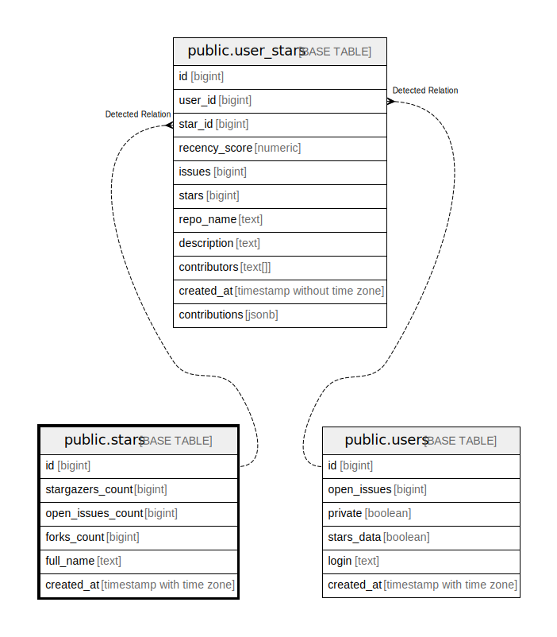

# public.stars

## Description

## Columns

| Name              | Type                     | Default | Nullable | Children                                  | Parents | Comment |
| ----------------- | ------------------------ | ------- | -------- | ----------------------------------------- | ------- | ------- |
| id                | bigint                   |         | false    | [public.user_stars](public.user_stars.md) |         |         |
| stargazers_count  | bigint                   | 0       | false    |                                           |         |         |
| open_issues_count | bigint                   | 0       | false    |                                           |         |         |
| forks_count       | bigint                   | 0       | false    |                                           |         |         |
| full_name         | text                     |         | false    |                                           |         |         |
| created_at        | timestamp with time zone | now()   | true     |                                           |         |         |

## Constraints

| Name                | Type        | Definition         |
| ------------------- | ----------- | ------------------ |
| stars_pkey          | PRIMARY KEY | PRIMARY KEY (id)   |
| stars_full_name_key | UNIQUE      | UNIQUE (full_name) |

## Indexes

| Name                | Definition                                                                      |
| ------------------- | ------------------------------------------------------------------------------- |
| stars_pkey          | CREATE UNIQUE INDEX stars_pkey ON public.stars USING btree (id)                 |
| stars_full_name_key | CREATE UNIQUE INDEX stars_full_name_key ON public.stars USING btree (full_name) |

## Relations

---

> Generated by [tbls](https://github.com/k1LoW/tbls)
