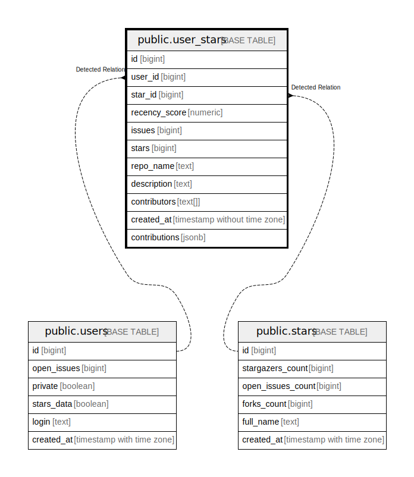

# public.user_stars

## Description

## Columns

| Name          | Type                        | Default | Nullable | Children | Parents                         | Comment |
| ------------- | --------------------------- | ------- | -------- | -------- | ------------------------------- | ------- |
| id            | bigint                      |         | false    |          |                                 |         |
| user_id       | bigint                      |         | false    |          | [public.users](public.users.md) |         |
| star_id       | bigint                      |         | false    |          | [public.stars](public.stars.md) |         |
| recency_score | numeric                     |         | true     |          |                                 |         |
| issues        | bigint                      | 0       | false    |          |                                 |         |
| stars         | bigint                      | 0       | false    |          |                                 |         |
| repo_name     | text                        |         | true     |          |                                 |         |
| description   | text                        |         | true     |          |                                 |         |
| contributors  | text[]                      |         | false    |          |                                 |         |
| created_at    | timestamp without time zone | now()   | true     |          |                                 |         |

## Constraints

| Name            | Type        | Definition       |
| --------------- | ----------- | ---------------- |
| user_stars_pkey | PRIMARY KEY | PRIMARY KEY (id) |

## Indexes

| Name            | Definition                                                                |
| --------------- | ------------------------------------------------------------------------- |
| user_stars_pkey | CREATE UNIQUE INDEX user_stars_pkey ON public.user_stars USING btree (id) |

## Relations

---

> Generated by [tbls](https://github.com/k1LoW/tbls)
