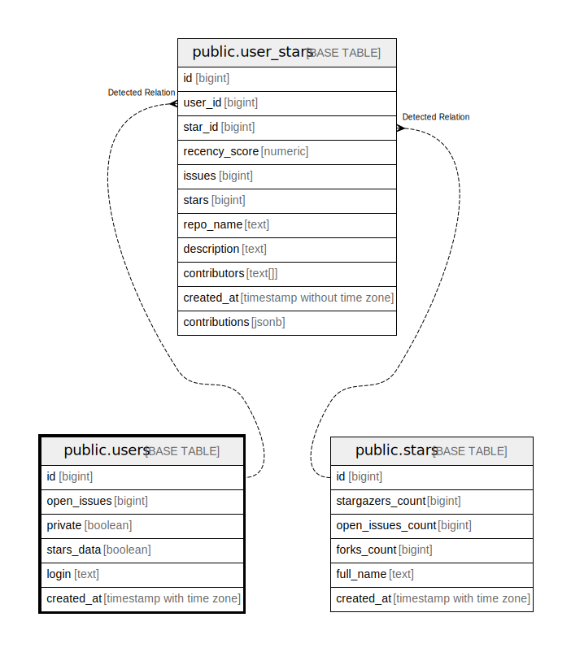

# public.users

## Description

## Columns

| Name                  | Type                     | Default | Nullable | Children                                                                                                                    | Parents | Comment |
| --------------------- | ------------------------ | ------- | -------- | --------------------------------------------------------------------------------------------------------------------------- | ------- | ------- |
| id                    | bigint                   |         | false    | [public.users_to_repos_stars](public.users_to_repos_stars.md) [public.users_to_repos_votes](public.users_to_repos_votes.md) |         |         |
| open_issues           | bigint                   | 0       | false    |                                                                                                                             |         |         |
| has_stars_data        | boolean                  | false   | false    |                                                                                                                             |         |         |
| is_private            | boolean                  | false   | false    |                                                                                                                             |         |         |
| is_open_sauced_member | boolean                  | false   | false    |                                                                                                                             |         |         |
| created_at            | timestamp with time zone | now()   | true     |                                                                                                                             |         |         |
| login                 | varchar(255)             |         | true     |                                                                                                                             |         |         |

## Constraints

| Name            | Type        | Definition       |
| --------------- | ----------- | ---------------- |
| users_pkey      | PRIMARY KEY | PRIMARY KEY (id) |
| users_login_key | UNIQUE      | UNIQUE (login)   |

## Indexes

| Name            | Definition                                                              |
| --------------- | ----------------------------------------------------------------------- |
| users_pkey      | CREATE UNIQUE INDEX users_pkey ON public.users USING btree (id)         |
| users_login_key | CREATE UNIQUE INDEX users_login_key ON public.users USING btree (login) |

## Relations

---

> Generated by [tbls](https://github.com/k1LoW/tbls)
