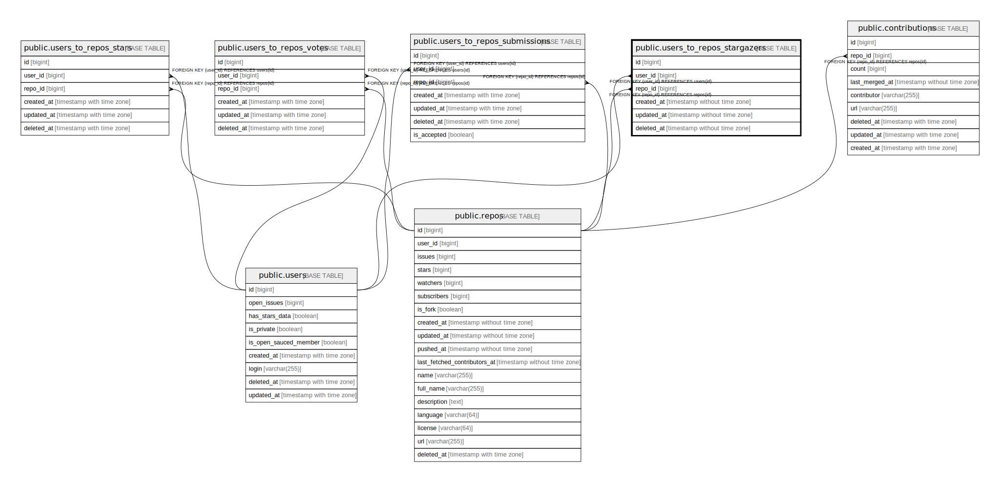

# public.users_to_repos_stargazers

## Description

## Columns

| Name       | Type                        | Default | Nullable | Children | Parents                         | Comment |
| ---------- | --------------------------- | ------- | -------- | -------- | ------------------------------- | ------- |
| id         | bigint                      |         | false    |          |                                 |         |
| user_id    | bigint                      |         | false    |          | [public.users](public.users.md) |         |
| repo_id    | bigint                      |         | false    |          | [public.repos](public.repos.md) |         |
| created_at | timestamp without time zone | now()   | false    |          |                                 |         |
| updated_at | timestamp without time zone | now()   | false    |          |                                 |         |
| deleted_at | timestamp without time zone |         | true     |          |                                 |         |

## Constraints

| Name                                   | Type        | Definition                                 |
| -------------------------------------- | ----------- | ------------------------------------------ |
| users_to_repos_stargazers_repo_id_fkey | FOREIGN KEY | FOREIGN KEY (repo_id) REFERENCES repos(id) |
| users_to_repos_stargazers_user_id_fkey | FOREIGN KEY | FOREIGN KEY (user_id) REFERENCES users(id) |
| stargazers_pkey                        | PRIMARY KEY | PRIMARY KEY (id)                           |
| stargazers_hash                        | UNIQUE      | UNIQUE (user_id, repo_id)                  |

## Indexes

| Name            | Definition                                                                                             |
| --------------- | ------------------------------------------------------------------------------------------------------ |
| stargazers_pkey | CREATE UNIQUE INDEX stargazers_pkey ON public.users_to_repos_stargazers USING btree (id)               |
| stargazers_hash | CREATE UNIQUE INDEX stargazers_hash ON public.users_to_repos_stargazers USING btree (user_id, repo_id) |

## Relations

---

> Generated by [tbls](https://github.com/k1LoW/tbls)
