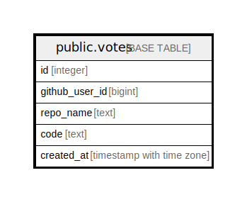

# public.votes

## Description

## Columns

| Name           | Type                     | Default | Nullable | Children | Parents | Comment |
| -------------- | ------------------------ | ------- | -------- | -------- | ------- | ------- |
| id             | integer                  |         | false    |          |         |         |
| github_user_id | bigint                   |         | false    |          |         |         |
| repo_name      | text                     |         | true     |          |         |         |
| code           | text                     |         | true     |          |         |         |
| created_at     | timestamp with time zone | now()   | true     |          |         |         |

## Constraints

| Name           | Type        | Definition       |
| -------------- | ----------- | ---------------- |
| votes_pkey     | PRIMARY KEY | PRIMARY KEY (id) |
| votes_code_key | UNIQUE      | UNIQUE (code)    |

## Indexes

| Name           | Definition                                                            |
| -------------- | --------------------------------------------------------------------- |
| votes_pkey     | CREATE UNIQUE INDEX votes_pkey ON public.votes USING btree (id)       |
| votes_code_key | CREATE UNIQUE INDEX votes_code_key ON public.votes USING btree (code) |

## Relations

---

> Generated by [tbls](https://github.com/k1LoW/tbls)
